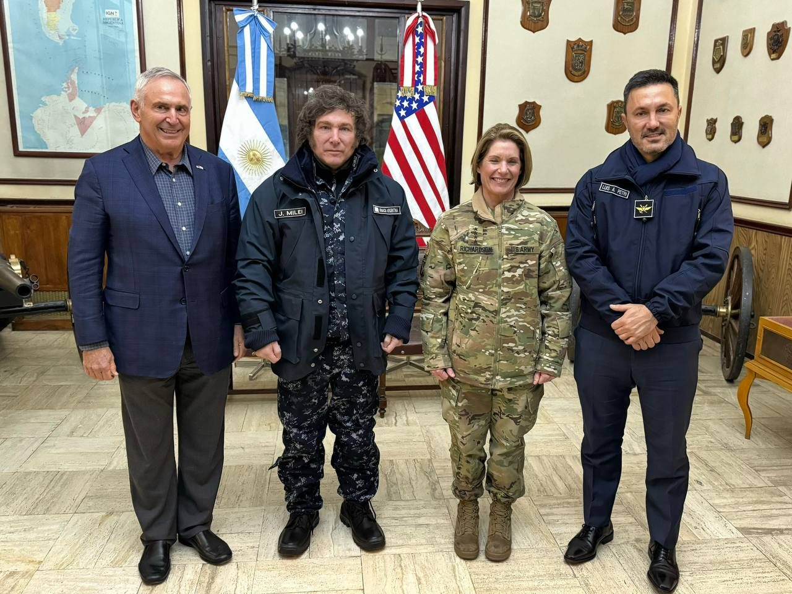
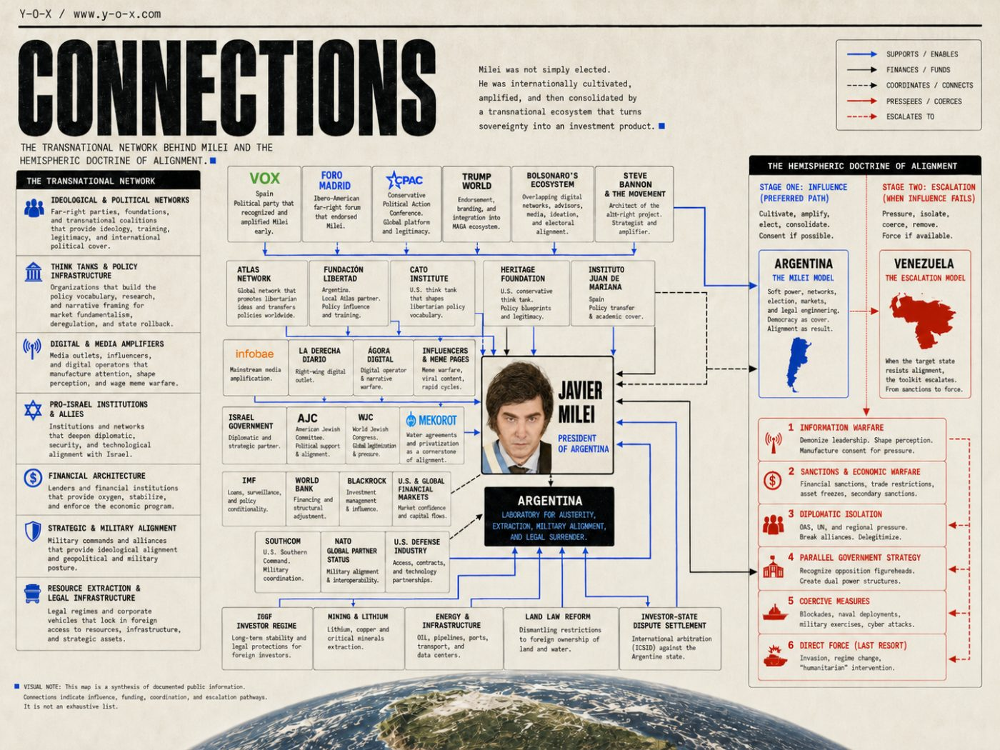

Javier Milei did not arrive at the end of the world by accident.

In April 2024, Argentina’s new president flew to Ushuaia, the southernmost city in the country, dressed in military camouflage, to meet General Laura Richardson, commander of U.S. Southern Command. The photo looked like theater. It was also geography: Antarctica, the South Atlantic, the maritime hinge between oceans, and a country learning how quickly “freedom” can become military alignment.

That is the Milei story in miniature.

A crisis at home. A network abroad. A president with a chainsaw. And behind him, a queue of think tanks, lenders, platform owners, generals, mining companies, arbitration lawyers, and pro-Israel institutions ready to help turn Argentina into a test site.

A few weeks after Ushuaia, Argentina requested NATO global partner status. A few months after that, Milei’s government was pushing investor regimes that offered foreign capital long-term stability over minerals, energy, infrastructure, and technology. In the north, lithium-rich provinces were already wrestling with water scarcity, Indigenous resistance, and agreements with Mekorot, Israel’s state water company. In the south, the government tried to dismantle the Land Law that restricted foreign ownership of rural land and freshwater basins.

This is where the cartoon version of geopolitics fails.

There is no need to invent a secret “Plan Andinia,” the old antisemitic conspiracy theory claiming that Jews or Zionists are plotting to carve a second state out of Patagonia. That myth is baseless, dangerous, and politically useful only to people who want serious critiques dismissed as bigotry.

The real story is not a secret invasion.

It is an open transaction.

Argentina’s soil, water, ports, minerals, military posture, foreign policy, and legal architecture are being reorganized under the language of freedom. The transnational network did not cultivate Milei out of charity. It cultivated a president capable of turning sovereignty into an investment product.

The simpler version of the Milei story goes like this: Argentina was broke, furious, humiliated, and exhausted. Inflation was eating the country alive. The old parties had failed. The peso had become a national punchline. So the people chose the wild man with the chainsaw.

That version is not false. It is just incomplete.

Milei did win an election. He did receive a democratic mandate. Millions of Argentines voted for him because their lives had become unbearable under the existing political order. Any serious analysis has to begin there. The anger was real. The inflation was real. The collapse of trust was real.

But Milei was not simply elected.

He was internationally cultivated, amplified, and then consolidated by a transnational far-right infrastructure that had been waiting for a figure exactly like him: violent in rhetoric, theatrical in style, market-fundamentalist in economics, anti-left by instinct, pro-Israel by conviction, useful to Washington, fluent in meme warfare, and willing to turn Argentina into a laboratory.

This was not the old Cold War model: tanks in the capital, a general on television, a president flown out in the middle of the night. It was cleaner than that. More modern. More deniable. More networked.

Milei was not hand-picked in the old sense of a foreign-installed puppet. He was **network-picked**.

Vox saw him. Foro Madrid embraced him. CPAC promoted him. Trump-world branded him. Bolsonaro’s digital ecosystem overlapped with his campaign. Steve Bannon’s continental anti-left project found in him a useful spearhead. The Atlas Network and its local partner institutions had spent decades normalizing the libertarian policy vocabulary that made him intelligible. Pro-Israel institutions treated him as a diplomatic prize. Tech oligarchs treated him as a regulatory dream. The IMF and World Bank gave oxygen to his experiment. SOUTHCOM and NATO channels converted ideological alignment into military posture. RIGI transformed the chainsaw into a legal instrument for foreign capital.

The Argentine people cast the votes. But the international machine helped build the myth, amplify the candidate, and consolidate the government.

And if Argentina shows the soft model — the stage where the desired political project is cultivated through networks and validated through elections — Venezuela shows the hard model. When influence fails, when sanctions fail, when parallel-government recognition fails, when the hostile state refuses to collapse, the ladder of pressure does not necessarily stop. It can move from persuasion to coercion, from coercion to force.

That is the real story: not simply “democracy versus dictatorship,” but a hemispheric doctrine of alignment.

Consent if possible.

Coercion if necessary.

Force if available.

---

## What this article is — and is not — saying

This piece is not claiming that Milei received no real votes.

It is not claiming that Argentines were mind-controlled by foreigners.

It is not claiming that Israel secretly controlled Argentina’s election.

It is not claiming that Steve Bannon personally signed off on every decision inside Milei’s campaign.

It is not claiming that all foreign actors sat in one room and drew up a master plan.

The sharper claim is this: Milei’s rise was embedded in a documented transnational ecosystem of parties, foundations, media outlets, campaign strategists, digital operators, conferences, think tanks, pro-Israel institutions, platform capital, military alignment, resource extraction, and U.S.-aligned financial power.

This is how political selection works now.

Not always by appointing the candidate directly. Sometimes by recognizing him early. Inviting him in. Giving him a language. Giving him enemies. Giving him donors, audiences, platforms, validators, analysts, consultants, and post-election oxygen.

That is the Milei story.

But it is only the first stage of the larger story.

When a friendly candidate can be cultivated, amplified, elected, and consolidated, the process is presented as democracy. When the state resists the network, when the wrong government survives, when the wrong leader refuses to leave, the tools change. The vocabulary shifts from “freedom” and “reform” to “criminality,” “narco-terrorism,” “security threat,” “failed state,” “transition,” and “restoration of democracy.”

The first model manufactures consent.

The second manufactures removal.

---

## The domestic collapse objection

The strongest objection to this argument is also the most important truth inside it: Milei did not need foreigners to make Argentines angry.

Argentina’s political class had already done that work.

By 2023, the country was trapped in economic humiliation: triple-digit inflation, debt exhaustion, currency collapse, poverty, and a political system that seemed incapable of telling the truth, much less repairing the damage. Peronism was discredited by governing failure. The traditional opposition was divided and uninspiring. For millions of voters, Milei did not appear as an ideological project first. He appeared as punishment.

That matters. Any serious analysis has to admit it.

The international network did not invent Argentina’s crisis. It did not manufacture every grievance. It did not force millions of Argentines to distrust the old parties. It did not need to.

The crisis created the opening.

The network shaped what entered through it.

Domestic collapse explains the demand for rupture. The transnational far-right infrastructure explains the supply: why the rupture took this form, why this candidate was amplified, why this economic program became thinkable, why this foreign policy alignment followed immediately, and why the new government was so quickly rewarded by Washington-aligned finance, pro-Israel institutions, tech capital, and military partnership.

A failed political class can produce many kinds of rebellion. It can produce left-populist renewal, nationalist protectionism, anti-corruption centrism, military nostalgia, social democracy, or technocratic reform. In Argentina, the rebellion was captured by a libertarian far-right project already prepared by decades of think-tank work, media normalization, digital warfare, and international elite validation.

The network did not create the fire.

It built the chimney.

---

## Stage zero: exhaustion

Before networked selection comes exhaustion.

This is the condition that makes the model work. A population has to be made desperate enough, angry enough, or disappointed enough to accept a candidate who would otherwise look extreme. Hyperinflation turns cruelty into discipline. Debt turns austerity into realism. Corruption turns anti-politics into purity. Institutional decay turns demolition into common sense.

This is **Shock Doctrine 2.0**.

The old shock doctrine used military dictatorships, coups, or disasters to impose structural adjustment from above. The updated version does not always need soldiers. It can use economic collapse to persuade people to vote for their own structural adjustment. The trauma is domestic; the policy menu is international.

That is why the counter-argument does not defeat the thesis. It completes it.

Milei was possible because Argentina was exhausted.

Milei became useful because the network was ready.

---

## The new model: political selection before the coup

Foreign influence in Latin America is usually imagined in black-and-white footage: CIA cables, military juntas, dead students, oil executives, generals wearing sunglasses. That history is real. But the modern version does not always begin with a coup.

It begins softer.

It begins with cultivation.

A candidate is identified early. He is invited into conferences. He signs manifestos. He is normalized by think tanks. He is translated for Washington as “reformist” rather than extremist. He is amplified by media platforms and influencer networks. Digital operators sharpen his message. Foreign ideological allies visit his campaign headquarters. Donors, markets, platform owners, military planners, mining companies, and financial institutions learn to see him as the acceptable vehicle for a broader project.

That is stage one: political selection without visible force.

The public sees the candidate. The machine sees the pipeline.

But the pipeline is not the whole strategy. It is the preferred strategy. It is cleaner, cheaper, and easier to defend as democracy. If the right candidate wins, there is no need for a coup. The ballot box produces the desired result, and the international network calls it freedom.

Argentina under Milei shows this stage clearly. He was cultivated through Atlas-linked libertarian infrastructure, Vox and Foro Madrid; amplified by CPAC and Trump-world; connected through Bolsonaro-linked digital operations; anchored in pro-Israel ideology; plugged into tech-capital enthusiasm; militarily aligned with Washington; opened to foreign investment through RIGI; and consolidated after victory by U.S.-aligned financial power.

But Venezuela shows what happens when softer forms of selection fail.

When the friendly candidate does not win, when the hostile government survives, when sanctions do not break the state, when recognition of an alternative leader does not transfer power, the model escalates.

First comes influence.

Then isolation.

Then delegitimization.

Then recognition of a parallel authority.

Then sanctions and asset warfare.

Then military threats, covert pressure, private incursions, or direct force.

This is not a conspiracy theory. It is an escalation ladder visible in the historical record.

The soft model says: let the network produce the candidate.

The hard model says: if the state refuses the network, the state itself becomes the target.

---

## The evidence standard

The receipts matter. So does the distinction between proof and inference.

| Claim / Dimension | Evidence level | Concrete proof / connection |
|---|---:|---|
| Domestic exhaustion created the opening | Documented | Inflation, debt, corruption, discredited parties, and a collapse of trust made an anti-system candidate viable |
| Systemic intellectual cultivation | Documented | Atlas Network partners such as Fundación Libertad helped normalize libertarian reform in Argentina |
| Milei won a real election | Documented | Milei won the 2023 runoff through real votes |
| Vox / Foro Madrid pipeline | Documented | Fundación Disenso and Foro Madrid accompanied Milei and Villarruel during the election period |
| U.S. conservative normalization | Documented | Heritage defended Milei before the runoff as not a danger to democracy |
| CPAC / Trump-world amplification | Documented | Milei appeared at CPAC, embraced Trump, and later hosted CPAC Buenos Aires |
| Bannon / Bolsonaro / Cerimedo digital bridge | Documented / strongly evidenced | Cerimedo worked with Milei and had links to Bolsonaro’s digital world; Bannon’s regional strategy ran through Bolsonaro-world |
| Active geopolitical realignment | Documented | Milei rejected Argentina’s planned 2024 entry into BRICS |
| Military integration with Washington | Documented | Milei met SOUTHCOM’s Laura Richardson in Ushuaia and Argentina requested NATO global partner status |
| Israel as ideological anchor | Documented | Genesis Prize / Isaac Accords and Milei’s “Israel as bastion of the West” rhetoric |
| Platform-level amplification | Documented | Elon Musk publicly praised Milei, met him, discussed lithium and free markets, and urged investment in Argentina |
| Structural resource opening | Documented | RIGI offers 30-year stability, tax/customs/FX benefits, no mandatory local procurement, and no export limits due to domestic supply needs |
| Multilateral financial underwriting | Documented | IMF approved a US$20B facility; World Bank announced a US$12B support package |
| Lithium / green extractivism pipeline | Documented | IFC partnered with Rio Tinto on the Rincón lithium project in Salta |
| Land-law liquidation attempt | Documented | DNU 70/2023 attempted to repeal the Ley de Tierras; courts blocked the repeal and the government later renewed the push |
| Water-planning infrastructure | Documented | Mekorot signed water-management agreements with multiple Argentine provinces, including Andean provinces tied to resource conflicts |
| Plan Andinia myth correction | Documented | ADL identifies Plan Andinia as a baseless antisemitic conspiracy theory, not evidence of real territorial annexation |
| Legal trapdoor / arbitration sovereignty | Documented | RIGI disputes can move to international arbitration under PCA, ICC, or ICSID-style rules after consultation; non-ICSID seats must be outside Argentina |
| Venezuela escalation model | Documented | U.S. recognition of Guaidó, sanctions, and later direct military capture of Maduro |
| Bannon personally ran Milei’s campaign | Not proven publicly | No public contract, command structure, or leaked operational record |
| Israel directly controlled Milei’s election | Not proven publicly | Strong ideological and diplomatic alignment, but no public proof of direct electoral control |

The point is not to inflate the case into a cartoon. The point is to show the network clearly enough that the official story — “he just came out of nowhere because voters were angry” — collapses under the weight of the receipts.

---

---

## Atlas Network: the missing institutional tissue

Vox and CPAC explain the political theater. Heritage explains the Washington translation. But to understand why Milei’s economic language was ready-made — dollarization, deregulation, labor “flexibility,” austerity, privatization, anti-union policy, attacks on the state as a parasite — one has to look at the deeper infrastructure of libertarian thought-manufacturing.

That infrastructure is the **Atlas Network**.

Atlas is a U.S.-based nonprofit that supports, trains, and connects free-market think tanks across the world. Its model is not merely ideological. It is institutional. It creates and connects the local organizations that make neoliberal policy sound native, urgent, technical, and inevitable.

In Argentina, Atlas-linked institutions such as Fundación Libertad helped prepare the terrain for Milei’s reform politics. Atlas itself published an article titled “Sharpening Milei’s Chainsaw: Atlas Network Partners Spur Reform,” saying that “numerous Atlas Network partners have been laying the foundation for Argentina’s transformation for decades” and specifically naming Fundación Libertad as a Rosario-based Atlas partner involved in labor reform debates. ([Atlas Network — Sharpening Milei’s Chainsaw](https://www.atlasnetwork.org/articles/sharpening-mileis-chainsaw-atlas-network-partners-spur-reform))

That line is extraordinary because it admits the long timeline.

Milei did not invent the chainsaw. He inherited the hardware.

The intellectual terrain had been prepared for years by think tanks, policy shops, business forums, media commentators, and libertarian institutions that taught Argentina’s elite and middle class to see the state as the enemy and the market as salvation.

This shifts the article’s frame. Milei was not just the product of a sudden far-right alliance after 2020. He was the political harvest of a longer project: the patient construction of an ecosystem in which radical market discipline could be presented as liberation.

This is not merely influence.

It is intellectual colonization.

---

## The Vox pipeline: Milei before Milei became president

Before Milei became president, he was already part of the Spanish-speaking far-right’s international architecture.

The key structure is **Foro Madrid**, created by Fundación Disenso, the think tank connected to Spain’s far-right party Vox. Foro Madrid presents the Carta de Madrid as its founding document, a declaration in defense of freedom, democracy, and the rule of law in the “Iberosphere.” ([Foro Madrid official site](https://foromadrid.org/))

The broader public record describes Foro Madrid as an alliance created by Fundación Disenso, a Vox-linked think tank, with the Carta de Madrid signed by libertarian, conservative, ultraconservative, and far-right figures across Latin America, Spain, and beyond. Javier Milei and Victoria Villarruel appear among the listed signatories in public summaries of the Madrid Charter network. ([Foro Madrid — Wikipedia summary](https://es.wikipedia.org/wiki/Foro_Madrid))

That already matters. Milei was not just some Argentine economist with a television temper. He was plugged into an international ideological document designed to coordinate the Latin American and European right.

But the stronger evidence came during the election itself.

On October 25, 2023, Foro Madrid published that a delegation from **Fundación Disenso and Foro Madrid traveled to Buenos Aires to support Javier Milei and Victoria Villarruel**, the La Libertad Avanza presidential ticket. The article says the delegates were **invited by Milei’s team** to follow the results and that they were present in the official campaign environment. ([Foro Madrid — Fundación Disenso y Foro Madrid acompañan a Javier Milei en las elecciones](https://foromadrid.org/fundacion-disenso-y-foro-madrid-acompanan-a-javier-milei-en-las-elecciones/))

This was not distant ideological sympathy. This was a Vox-linked transnational political delegation, invited by Milei’s team, present in Buenos Aires, supporting the ticket, and watching the election from inside the campaign’s orbit.

Foro Madrid’s own framing made the stakes regional. The Argentine election was not just Argentina’s election. It was treated as a battle in the Iberosphere against the Foro de São Paulo, Grupo de Puebla, socialism, and the Latin American left. ([Foro Madrid — Fundación Disenso y Foro Madrid acompañan a Javier Milei en las elecciones](https://foromadrid.org/fundacion-disenso-y-foro-madrid-acompanan-a-javier-milei-en-las-elecciones/))

That is the language of regional war. Not a normal election. A continental front.

The idea of Argentina as a laboratory was not invented by Milei’s critics. It was already present in the language of the network that came to support him.

---

## Washington’s translation service: Heritage normalizes the outsider

If Vox and Foro Madrid helped situate Milei inside the Spanish-speaking right, U.S. conservative institutions helped translate him for Washington.

On November 8, 2023, before the runoff, the Heritage Foundation published Joseph Humire’s article titled **“Argentina’s Javier Milei Is Not a ‘Danger for Democracy.’”** Heritage described Milei as a libertarian populist preparing to face Sergio Massa and argued that the real reason Milei upset elite institutions was not anti-democratic behavior but his anti-establishment policies. ([Heritage Foundation — Argentina’s Javier Milei Is Not a “Danger for Democracy”](https://www.heritage.org/americas/commentary/argentinas-javier-milei-not-danger-democracy))

This was elite normalization. A major U.S. conservative think tank was telling English-speaking policy audiences: do not fear this man; he may be exactly what Argentina needs.

That matters because international legitimacy is a form of power. A candidate can be outrageous at home and still be made respectable abroad. Heritage’s role was not to deliver votes in Buenos Aires. It was to make Milei legible inside Washington’s conservative policy class: anti-China, anti-socialist, pro-market, useful.

He was not a danger. He was an opportunity.

---

## CPAC: from candidate to global conservative mascot

After Milei won, the U.S. conservative movement moved fast.

In February 2024, Milei appeared at CPAC near Washington, D.C. Associated Press reported that Milei greeted Donald Trump with an enthusiastic hug and that his campaign style had already echoed Trump’s, including red “Make Argentina Great Again” hats. AP also noted that Milei joined other foreign politicians at CPAC echoing themes such as opposition to socialism and economic regulation. ([Associated Press — Milei gives Trump an exuberant hug at CPAC](https://apnews.com/article/f8e97d401a13318f8cc55faf29021030))

The image was perfect: Trump, the former U.S. president trying to return to power, embracing Milei, the new Argentine president who had turned anti-socialist rage into executive power.

CPAC is often described as a conference. That is technically true and politically misleading. CPAC is an infrastructure: donors, media, operatives, politicians, policy shops, influencers, ideological entrepreneurs, and foreign right-wing leaders all circulating through one branded ecosystem.

Later, CPAC came to Argentina. El País described Milei at CPAC Buenos Aires in December 2024 as a symbol of the global far right, surrounded by figures such as Santiago Abascal and Eduardo Bolsonaro, while calling for a fight against socialism, climate politics, gender ideology, immigration, and the left. ([El País — Milei se erige en símbolo de la ultraderecha global](https://elpais.com/argentina/2024-12-05/milei-se-erige-en-simbolo-de-la-ultraderecha-global-hay-que-acabar-de-una-vez-con-la-basura-del-socialismo.html))

Le Monde described the Buenos Aires event as an attempt by Milei to organize a conservative international, with figures including Lara Trump, Santiago Abascal, and Eduardo Bolsonaro present. ([Le Monde — Javier Milei veut organiser une internationale des conservateurs](https://www.lemonde.fr/international/article/2024/12/05/en-argentine-javier-milei-veut-organiser-une-internationale-des-conservateurs_6431697_3210.html))

By then, Milei was no longer just the president of Argentina.

He was a product demo.

The message was simple: this can be done elsewhere.

---

## The Bannon question: not the puppet master, but the architecture

The claim that “Steve Bannon ran Milei’s campaign” is not publicly proven. There is no public contract, no leaked command structure, no hard document showing Bannon formally directed the campaign.

But that is the wrong standard. Bannon’s influence in Latin America did not need to arrive as a campaign invoice. It arrived as method, ideology, network, and bridge.

The key bridge is **Eduardo Bolsonaro**.

Public reporting has described the flow of personnel, tactics, and narratives between U.S. Trump-world, Bolsonaro-world, and the Latin American right. Brazilian investigations and reporting have documented Eduardo Bolsonaro’s role as a regional connector, his relationship to CPAC infrastructure, and the broader attempt to internationalize Bolsonaro-style politics across the hemisphere. ([The Guardian — Jair Bolsonaro charged over alleged coup plot](https://www.theguardian.com/world/2024/nov/21/jair-bolsonaro-charged-coup-plot))

This is the Bannon map: Trump-world to Bolsonaro-world, Bolsonaro-world to Latin America, CPAC as the meeting ground, anti-communism as the glue, digital warfare as the method.

And then comes Fernando Cerimedo.

---

## Fernando Cerimedo: the digital hinge

Fernando Cerimedo is one of the most important figures in this story because he turns the argument from ideological similarity into operational overlap.

Buenos Aires Herald reported that Cerimedo worked as Milei’s digital strategist in 2023 and that, before advising Milei, he had worked for Bolsonaro’s campaign and became a visible figure among Bolsonaro supporters. The same reporting said Brazilian judicial authorities accused him of being instrumental in the dissemination of false information around Brazil’s electoral system. ([Buenos Aires Herald — Milei’s former digital guru targeted in Brazil coup attempt probe](https://buenosairesherald.com/politics/mileis-former-digital-guru-targeted-in-brazil-coup-attempt-probe))

Buenos Aires Herald also reported that Brazilian Federal Police formally accused Bolsonaro and 36 others of plotting a coup attempt after Bolsonaro’s defeat, and that Fernando Cerimedo, described as Milei’s 2023 digital strategist, was among those charged at that stage of the investigation. ([Buenos Aires Herald — Brazil coup attempt: Bolsonaro and 36 others face charges](https://buenosairesherald.com/world/latin-america/brazil-coup-attempt-bolsonaro-and-36-others-face-charges))

The Guardian likewise reported that Brazilian police accused Bolsonaro and 36 others of plotting a coup and that Fernando Cerimedo, an Argentine digital marketing expert connected to Milei’s campaign, appeared on the list. ([The Guardian — Jair Bolsonaro charged over alleged coup plot](https://www.theguardian.com/world/2024/nov/21/jair-bolsonaro-charged-coup-plot))

This is the cleanest version of the claim:

Bannon’s influence reached Latin America through Bolsonaro-world. Eduardo Bolsonaro became a regional connector for Trumpist and Bannon-style politics. Cerimedo operated inside Bolsonaro’s digital ecosystem. Cerimedo then became a key communications and digital figure for Milei.

That does not prove Bannon personally ran Milei’s campaign.

It proves something more networked and arguably more important: Milei’s campaign was pushed through the same Bannonized, Bolsonaro-linked infrastructure that had already been tested in Brazil — social media shock tactics, anti-left hysteria, election-system suspicion, culture-war branding, and a media ecosystem built to move faster than facts.

---

## Algorithmic statecraft: Musk, X, lithium, and the tech-right

The digital war around Milei was not only a Bannon-style campaign tactic. It also connected to a newer structure: platform capitalism.

Here, Elon Musk matters.

Musk did not merely post memes about Milei. He became a symbolic validator of the Argentine experiment. In April 2024, Milei met Musk at Tesla’s factory in Austin, Texas. Argentine reporting said they discussed lithium investments, removing bureaucratic obstacles for investors, and organizing a major event in Argentina around “freedom” ideas. ([La Nación — Milei se reunió en Texas con Elon Musk](https://www.lanacion.com.ar/politica/antes-de-viajar-a-texas-para-ver-a-musk-javier-milei-se-reunio-con-empresarios-en-miami-nid12042024/))

Reuters-linked reporting described Musk and Milei as agreeing on free markets and potential lithium projects after the meeting. ([Asharq Al-Awsat / Reuters — Musk, Argentine President See Eye-To-Eye on Free Markets, Lithium](https://english.aawsat.com/technology/4963136-musk-argentine-president-see-eye-eye-boosting-free-markets-lithium))

Musk later publicly urged investment in Argentina in a post with Milei. MarketWatch reported that Musk posted “I recommend investing in Argentina,” while noting that Musk and Milei had discussed space exploration and Argentina’s lithium reserves. ([MarketWatch — Invest in Argentina, Musk says in post alongside Milei](https://www.marketwatch.com/story/invest-in-argentina-musk-says-in-post-alongside-milei-375e7474))

This is not just celebrity politics. It is **algorithmic statecraft**.

When a platform owner with global reach endorses a president whose program is deregulation, austerity, resource opening, and anti-woke politics, the platform becomes part of the geopolitical field. X is not simply a public square. It is a privately owned amplification machine with ideological preferences.

For the tech-right, Milei is not just a president. He is a regulatory blueprint.

A country willing to weaken labor protections, reduce environmental constraints, offer long-term investor stability, open lithium extraction, and perform ideological loyalty to the “free market” becomes a test site for corporate autonomy.

Milei is what happens when platform oligarchy meets shock therapy.

---

## BRICS rejection: the geopolitical litmus test

The cleanest proof of Milei’s geopolitical realignment came before any complicated theory was necessary.

Argentina had been invited to join BRICS — the bloc then composed of Brazil, Russia, India, China, and South Africa — as part of its January 2024 expansion. Milei rejected the invitation before Argentina’s entry took effect.

Associated Press reported that Milei formally declined Argentina’s planned BRICS membership in a letter dated December 22, 2023, reversing the previous government’s decision and aligning with his preference for the United States and Israel. ([AP — Milei formally declines invitation to join BRICS](https://apnews.com/article/46f2f7cdbdf6ff66523608503a6648d5))

This matters because BRICS was not a symbolic book club. It represented an attempt by parts of the Global South to create alternative economic and diplomatic weight outside the U.S.-European orbit.

By rejecting BRICS, Milei did not merely make a foreign-policy choice. He performed a geopolitical sorting ritual.

Argentina could have used BRICS to diversify its external relations, strengthen links with Brazil and China, and increase bargaining power in a multipolar order. Milei chose instead to return Argentina to Washington’s financial gravity well and to make pro-U.S., pro-Israel alignment the central axis of foreign policy.

This is where the doctrine becomes concrete.

Alignment was not just rhetoric.

It was policy.

---

## Israel: not a foreign-policy footnote, but the moral center of Milei’s project

Milei’s pro-Israel politics are not decorative. They are central to his identity.

For Milei, Israel is not merely a state with which Argentina has diplomatic relations. It is a civilizational symbol: the “West,” capitalism, anti-socialism, anti-terrorism, anti-Iran politics, and Judeo-Christian identity compressed into one flag.

In 2025, the Genesis Prize Foundation honored Milei and explicitly tied his award to the goal of ending Israel’s isolation and deepening Israel’s ties with Latin America. The foundation said it would work with organizations such as StandWithUs, the Israel Allies Foundation, the Foundation to Combat Antisemitism, and the Israel Latin American Network to help make Milei’s proposed **Isaac Accords** a reality. ([Genesis Prize Foundation — Ending Israel isolation main theme](https://www.genesisprize.org/press-center/2025-06-12-ending-israel-isolation-main-theme-as-genesis-prize-honors-argentine-president-javier-milei-in-jerusalem))

The Genesis Prize Foundation later described the Isaac Accords as Milei’s vision to strengthen economic, cultural, and diplomatic ties between Israel and Latin America, bringing the spirit of the Abraham Accords to the Western Hemisphere. ([Genesis Prize Foundation — Isaac Accords](https://www.genesisprize.org/press-center/2025-10-29-the-isaac-accords-building-new-bridges-between-israel-and-latin-america))

This is not just diplomacy. It is a regional project.

Milei wants Argentina to become a platform for Israel-Latin America alignment. In the logic of the far-right international, Israel functions as the frontline of “the West” against enemies that are deliberately blurred together: Hamas, Iran, terrorism, socialism, Palestine solidarity, anti-colonial politics, and the left.

Milei said the quiet part out loud. In June 2026, El País reported that during a Madrid speech he defended Israel as **“the bastion of the West”** and linked hostility to Israel with the left and terrorism. ([El País — Milei defiende Israel como bastión de Occidente](https://elpais.com/espana/2026-06-26/milei-lanza-en-madrid-un-alegado-a-favor-del-estado-de-israel-como-bastion-de-occidente.html))

That line belongs in the center of the article because it reveals the architecture of Milei’s worldview.

The economy is not separate from the culture war. The culture war is not separate from foreign policy. Foreign policy is not separate from Israel. Israel is not separate from the larger anti-left crusade.

It is one package.

---

## Ideological laundering: the crusade that covers the sell-off

Milei’s obsession with a “Judeo-Christian West” is not merely personal eccentricity. It is political technology.

When he travels to Madrid, Washington, Miami, or Jerusalem to declare that Israel is the “bastion of the West,” he is not only making a foreign-policy statement. He is laundering domestic shock therapy through civilizational language.

Austerity becomes moral courage.

Deregulation becomes freedom.

Resource extraction becomes modernization.

Alignment with Washington and Tel Aviv becomes the defense of the West.

This is why the rhetoric matters. It transforms a brutal economic program into a crusade. It gives foreign allies a reason to defend him unconditionally. It turns critics into enemies of civilization rather than opponents of policy.

Behind the sermon, the state is being unbolted.

Behind the culture war, land law, water planning, lithium extraction, military posture, and investor protections are being rewritten.

---

## The military anchor: SOUTHCOM, Ushuaia, and NATO global partner status

The geopolitical transaction was not only ideological or financial. It also had a military dimension.

In April 2024, Milei flew to Ushuaia, Tierra del Fuego, to meet U.S. Army General Laura Richardson, then commander of U.S. Southern Command. Argentina’s own government said the meeting aimed to reinforce strategic cooperation and exchange between Argentina and the United States. ([Argentina.gob.ar — Milei met Laura Richardson in Ushuaia](https://www.argentina.gob.ar/noticias/el-presidente-milei-se-reunio-en-ushuaia-con-laura-richardson-jefa-del-comando-sur-de-los))

SOUTHCOM’s own statement said Richardson visited Argentina from April 2 to 6, 2024, to foster dialogue and collaboration with the new government and defense leaders and to underscore the commitment to enhancing the strategic partnership between the two countries. ([SOUTHCOM — Gen. Richardson Meets with President Milei](https://www.southcom.mil/MEDIA/NEWS-ARTICLES/Article/3733211/gen-richardson-meets-with-president-milei-defense-leaders-in-argentina/))

The location was not incidental. Ushuaia is the southernmost city in Argentina, the gateway to Antarctica, and a strategic point near the maritime passage between the Atlantic and Pacific oceans. It sits at the end of the continent, where geography becomes military doctrine.

El País later reported that during the April 2024 meeting, Milei announced that the naval base Argentina was building in Ushuaia would become a shared project with the United States: an integrated logistics center and port of development closest to Antarctica, making the two countries a gateway to the “white continent.” ([El País — Milei toma el control del puerto más austral de Argentina](https://elpais.com/argentina/2026-01-24/milei-toma-el-control-del-puerto-mas-austral-de-argentina-y-la-oposicion-denuncia-un-acuerdo-con-trump.html))

That is the physical infrastructure behind the rhetoric.

The next move came weeks later. Argentina formally requested to become a NATO “global partner.” Associated Press reported on April 18, 2024, that Argentina had formally asked to join NATO as a global partner, a status that would allow closer political and security cooperation with the alliance while aligning Milei’s government more closely with Western powers. ([AP — Argentina asks to join NATO as global partner](https://apnews.com/article/bf56ef4b18646438500c921250c66e93))

This was a structural pivot. Argentina was not joining NATO as a member, and “global partner” status does not trigger NATO’s collective-defense obligations. But it does mean access to cooperation, training, technology, and military interoperability.

Put simply: Milei did not only choose Washington rhetorically. He began plugging Argentina’s military posture into Washington’s security architecture.

If BRICS rejection was the economic litmus test, Ushuaia and NATO were the military litmus test.

---

## The money: IMF oxygen and World Bank underwriting

Winning an election is one thing. Surviving the consequences is another.

Milei’s shock program needed external oxygen. Argentina was already tied to the IMF; Milei’s project required the confidence of international lenders, investors, and Washington-aligned institutions.

In April 2025, the IMF approved a **48-month, US$20 billion Extended Fund Facility** for Argentina, including an immediate **US$12 billion** disbursement. The IMF said the program would help catalyze additional official multilateral and bilateral support. ([IMF — Argentina: IMF Executive Board approves 48-month US$20 billion arrangement](https://www.imf.org/en/news/articles/2025/04/12/pr25101-argentina-imf-executive-board-approves-48-month-usd20-billion-extended-arrangement))

The IMF’s own program language said the arrangement supported Argentina’s stabilization and growth plan, external sustainability, and structural reforms to create a more open and market-oriented economy. ([IMF — Argentina request for Extended Fund Facility](https://www.imf.org/en/publications/cr/issues/2025/04/12/argentina-request-for-an-extended-arrangement-under-the-extended-fund-facility-press-566151))

The World Bank moved in parallel. On April 11, 2025, the World Bank Group announced a **US$12 billion support package** for Argentina’s economic reform program, calling it a strong vote of confidence in the government’s efforts to stabilize and modernize the economy. ([World Bank — US$12B Support Package for Argentina](https://www.worldbank.org/en/news/statement/2025/04/11/world-bank-group-announces-us-12-billion-support-package-for-argentina-economic-reform-program))

That is not a small detail. That is consolidation.

The IMF and World Bank do not knock on doors for Milei. They do something more powerful: they tell markets that his government has backing.

The pattern is clear: first the network elevates the figure; then institutions help stabilize the experiment.

This is the financial arm of political selection. The voters give a mandate. The lenders decide whether the mandate can breathe.

---

## RIGI and the resource yield: lithium, copper, and green extractivism

If the IMF and World Bank provided oxygen, RIGI provided the opening.

RIGI — the **Régimen de Incentivo para Grandes Inversiones**, or Large Investment Incentive Regime — was created under Law 27.742, the Ley Bases. Argentina’s own investor guide describes RIGI as a strategic program designed to attract and encourage large-scale investments in Argentina. ([Argentine Consulate in New York — RIGI Guide for Investors](https://cnyor.cancilleria.gob.ar/en/5-large-investment-incentive-scheme-rigi-guide-investors))

International tax and legal firms quickly understood what it meant: tax incentives, customs incentives, foreign-exchange benefits, legal certainty, and long-term stability for major investors. PwC describes RIGI as providing certainty and legal stability to long-term investments through tax, customs, and currency-exchange incentives. ([PwC — Argentina adopts new promotional regime for large investments](https://www.pwc.com/us/en/services/tax/library/argentina-adopts-new-promotional-regime-for-large-investments.html))

The Argentine government’s own promotional summary states that RIGI offers regulatory incentives such as no export limitation imposed by the state due to domestic supply needs, no state direction of infrastructure development, and no mandatory local procurement. ([Argentina RIGI summary — Cancillería PDF](https://chamb.cancilleria.gob.ar/userfiles/2018/2024-07-11_dnpri_sintesis_rigi_en_final.pdf))

That is the sovereignty question.

RIGI does not only attract capital. It constrains the future state. It promises investors stability against later democratic attempts to impose local-content rules, domestic supply requirements, export limits, or more burdensome regulation.

For mining, that matters enormously.

Argentina sits inside the Lithium Triangle, alongside Bolivia and Chile. Lithium is not just a commodity. It is “white gold”: a strategic input for electric vehicles, battery storage, military technologies, and the West’s green-transition supply chain.

Under RIGI, Milei’s Argentina offers foreign capital exactly what investors want: long-term fiscal stability, export freedom, foreign-exchange flexibility, and weaker state leverage over how resources are extracted, processed, and industrialized.

Rio Tinto’s Rincón lithium project in Salta is the emblem. Buenos Aires Herald reported that Argentina’s RIGI committee approved Rincón de Litio, a US$2.7 billion project by the British-Australian mining giant Rio Tinto, as the first lithium mining project approved under RIGI. ([Buenos Aires Herald — First lithium project approved under RIGI](https://buenosairesherald.com/business/mining/argentinas-rigi-committee-approves-first-lithium-mining-project))

In March 2026, IFC, the private-sector arm of the World Bank Group, announced a partnership with Rio Tinto to advance the Rincón Lithium Project, describing it as a large-scale greenfield development in Salta. ([IFC — Rio Tinto Rincón Lithium Project](https://www.ifc.org/en/pressroom/2026/ifc-partners-with-rio-tinto-on-rinc-n-lithium-project))

This is the extraction layer of the transaction.

The network helps manufacture and consolidate a government that uses the chainsaw on the state’s regulatory capacity. Then the resource regime opens. Lithium, copper, oil, gas, infrastructure, and technology become the prize.

This is **green extractivism**: the extraction of strategic minerals under the moral cover of the energy transition, with Indigenous territories, water systems, and peripheral regions turned into sacrifice zones for Western supply chains.

It is also Shock Doctrine 2.0: domestic crisis converted into democratic authorization for structural surrender.

---

## The legal trapdoor: sovereignty outsourced to arbitration

RIGI does not only open Argentina’s land, lithium, energy, infrastructure, and technology sectors to mega-investment. It also builds a legal trapdoor.

The network does not fully trust the local institutions of the countries it absorbs. It wants access to resources, but it also wants protection from future democracy. It wants to know that if a later Argentine government tries to regulate lithium extraction, limit water use, change tax treatment, impose stricter environmental rules, or reclaim strategic control, the fight will not remain inside Argentina’s ordinary political and judicial system.

That is what RIGI provides.

Under the regime, disputes between the Argentine state and qualifying investment vehicles that cannot be resolved through consultation may be submitted to international arbitration. Legal analyses of RIGI identify arbitration options including the Permanent Court of Arbitration, the International Chamber of Commerce, and ICSID, the World Bank-linked International Centre for Settlement of Investment Disputes. Commentary on Article 221 notes that, except when ICSID is chosen, the arbitral seat must be outside Argentina and in a country party to the New York Convention.

This is not a footnote. It is the legal architecture of dependency.

RIGI gives investors more than tax breaks and currency privileges. It gives them a route around the domestic state. It transforms future public-interest regulation into a potential international claim. It tells foreign capital: come extract, come build, come own — and if Argentina later changes its mind, you will not be trapped in Argentina’s courts.

This is the absolute institutionalization of the thesis.

Sovereignty is not only being sold. Its legal definition is being transferred.

If a future Argentine government attempts to protect water in Salta, limit extraction in Jujuy, defend land in Patagonia, or impose new conditions on foreign investors, it may not simply face domestic political opposition. It may face the financial and legal enforcement architecture of the transnational investment system itself.

That is the trapdoor.

The ballot box can open the country.

International arbitration can keep it open.

---

## The transaction layer: what the network got

This is the missing piece in most accounts of Milei.

The question is not only who helped him rise. The question is: what did they get?

They got geopolitical realignment: Argentina rejected BRICS and returned to the U.S.-Israel axis.

They got military posture: Argentina deepened cooperation with SOUTHCOM, turned Ushuaia into a strategic joint logistics project, requested NATO global partner status, bought Western military hardware, and moved closer to Western security architecture.

They got resource access: RIGI opened the door to long-term foreign investor protections in mining, energy, infrastructure, technology, oil, and gas.

They got lithium and copper pathways: Rio Tinto, IFC, and other capital networks gained a friendlier framework for extracting and exporting critical minerals.

They got platform validation: Musk and the tech-right found a head of state willing to praise deregulation, defend platform power, and advertise Argentina as open for investment.

They got ideological spectacle: Milei became the conference-stage proof that radical austerity could be sold as freedom.

That is the transaction.

Argentina got money, market confidence, and international applause.

The network got territory, resources, alignment, military access, and a prototype.

---

## From Argentina to Venezuela: two stages of the same doctrine

Venezuela and Argentina are not opposites. They are two stages of the same doctrine.

Argentina shows the preferred model: cultivate an aligned political figure before victory, amplify him during the campaign, celebrate him after the election, and consolidate him through diplomacy, finance, military cooperation, and resource opening.

Venezuela shows the escalation model: when an unfriendly government survives elections, sanctions, protests, diplomatic pressure, and recognition of an alternative leader, the strategy moves from influence to coercion and, eventually, force.

The 2002 coup attempt against Hugo Chávez was an early warning. Chávez was removed from office for 47 hours before being restored to power. A declassified U.S. intelligence brief from April 6, 2002, days before the coup, said dissident military factions were stepping up efforts to organize a coup and that plotters still lacked political cover. The document also said repeated U.S. warnings against extra-constitutional moves may have given pause to the plotters. That does not prove the United States directly ordered the coup, but it proves Washington knew coup plotting was underway before Chávez was removed. ([House of Commons Library — Venezuela: The Chávez era and U.S. relations](https://commonslibrary.parliament.uk/research-briefings/cbp-10452/))

In 2019, the escalation became more explicit. The United States formally recognized Juan Guaidó as Venezuela’s interim president, rejecting Nicolás Maduro’s authority and backing an alternative political center. ([U.S. State Department — Recognition of Juan Guaidó as Venezuela’s Interim President](https://2017-2021.state.gov/recognition-of-juan-guaido-as-venezuelas-interim-president/))

That was not merely criticism. It was an attempt to shift sovereignty: to decide which Venezuelan political figure the international system should treat as president.

But Guaidó did not take power. Sanctions did not remove Maduro. Diplomatic isolation did not break the state. The Venezuelan military did not decisively defect.

Then came the hard stage.

In January 2026, U.S. forces captured Nicolás Maduro and Cilia Flores in Caracas and transferred them to U.S. custody. The UK House of Commons Library describes the event as a January 2026 U.S. military operation to capture Maduro and examines the international-law questions it raised. ([House of Commons Library — The US capture of Nicolás Maduro](https://commonslibrary.parliament.uk/research-briefings/cbp-10452/))

The U.S. government described Maduro as being placed in U.S. custody following a military operation in Caracas and transported to federal detention in New York to await trial on federal charges. ([U.S. Department of State — Nicolás Maduro Moros](https://www.state.gov/nicolas-maduro-moros/))

Al Jazeera described the operation as an “abduction,” while Chatham House argued that the capture of Maduro and his wife by U.S. forces in Venezuela, and their forced transfer to the U.S. for trial, posed a major challenge for international law. ([Al Jazeera — How the US attack on Venezuela, abduction of Maduro unfolded](https://www.aljazeera.com/news/2026/1/4/how-the-us-attack-on-venezuela-abduction-of-maduro-unfolded)) ([Chatham House — The US capture of President Nicolás Maduro](https://www.chathamhouse.org/2026/01/us-capture-president-nicolas-maduro-and-attacks-venezuela-have-no-justification))

This is the point the article has to make clearly: the soft model and the hard model are not separate. They are parts of the same imperial toolkit.

When influence works, it looks like Argentina: networks, think tanks, campaign strategists, conferences, media amplification, military cooperation, financial rescue, resource opening, and diplomatic reward.

When influence fails, it can look like Venezuela: sanctions, recognition of a parallel president, asset warfare, military threats, covert operations, and direct seizure of the head of state.

One model says: manufacture consent.

The other says: manufacture removal.

Either way, the target is sovereignty.

---

## The doctrine: consent if possible, force if necessary

The clearest way to understand the pattern is not “democracy versus dictatorship.” That is the public language.

The deeper pattern is alignment versus independence.

If a leader aligns with U.S.-Israeli strategic priorities — markets open, debt honored, Israel defended, BRICS rejected, China contained, NATO cooperation expanded, lithium opened, socialism attacked, Palestine solidarity marginalized — that leader is treated as democratic, reformist, brave, or necessary.

If a leader resists those priorities — nationalizes resources, aligns with Cuba, China, Russia, Iran, or Palestine, challenges U.S. financial power, or survives outside Washington’s orbit — that leader is treated as illegitimate, criminal, authoritarian, terrorist-adjacent, or removable.

Sometimes the criticism is based on real abuses. Venezuela under Maduro had serious repression, corruption, electoral manipulation, and economic collapse. But the pattern is not neutral. The United States does not respond to all abuses the same way. It responds most aggressively when abuse overlaps with geopolitical disobedience.

That is why the article should not say simply, “they hand-picked Milei.”

The sharper argument is this:

They prefer to hand-pick through networks.

If that works, the process looks democratic.

If it fails, they escalate.

Argentina was the clean version: cultivate, amplify, consolidate, militarize, extract.

Venezuela was the dirty version: delegitimize, sanction, recognize an alternative, pressure the military, and eventually seize the president.

The doctrine is not subtle.

Consent if possible.

Coercion if necessary.

Force if available.

---

## The network around Milei

| Node | Function |
|---|---|
| Atlas Network / Fundación Libertad | Long-term libertarian policy formation and think-tank infrastructure |
| Vox / Fundación Disenso | Spanish-speaking far-right institutional infrastructure |
| Foro Madrid | Anti-left “Iberosphere” network linking Europe and Latin America |
| Carta de Madrid | Ideological pledge against communism and progressive blocs |
| Heritage Foundation | Washington policy normalization before the runoff |
| CPAC | U.S. conservative amplification and elite networking |
| Trump-world | Branding, legitimacy, MAGA-style identification |
| Steve Bannon | Strategic anti-left framing and nationalist-populist internationalism |
| Eduardo Bolsonaro | Regional bridge between Bolsonaroism, CPAC, and Trump-world |
| Fernando Cerimedo | Digital and communications bridge between Bolsonaro’s ecosystem and Milei’s campaign |
| La Derecha Diario | Media vehicle for far-right narratives and digital mobilization |
| Elon Musk / X | Platform amplification, tech-right validation, lithium/free-market signaling |
| Genesis Prize / Isaac Accords | Pro-Israel diplomatic validation and regional Israel-Latin America expansion |
| SOUTHCOM | U.S. military partnership and strategic posture |
| NATO global partner request | Formal movement toward Western security interoperability |
| IMF | Post-election stabilization and market credibility |
| World Bank / IFC | Reform underwriting and lithium-project financing |
| RIGI | Legal architecture for foreign investment stability and resource opening |
| International arbitration / ICSID-ICC-PCA | Legal trapdoor protecting qualifying investors from future domestic regulatory reversal |
| Mekorot | Israeli state water-company expertise entering provincial water planning |
| Ley de Tierras repeal attempt | Political push to weaken restrictions on foreign ownership of rural land and water-sensitive areas |
| Rio Tinto and mining capital | Extraction of lithium and critical minerals under the new regime |

The point is not that every node controlled every other node.

The point is that they converged.

That convergence is the story.

---

## The material payoff: liquidating the soil and water

The transnational network did not cultivate, amplify, and stabilize Milei out of ideological charity. A hemispheric doctrine of alignment requires a material return on investment. In Argentina, that return is measured in geography, soil, water, lithium, and access.

This is where the narrative has to be precise.

For decades, fringe conspiracy theories like **Plan Andinia** claimed that international Zionists had a secret plan to seize Patagonia and build a second Jewish state in southern Argentina and Chile. That story is an antisemitic hoax, not an analysis. It turns a serious question about land, water, and sovereignty into a cartoon, allowing Milei’s defenders to dismiss real investigation as conspiracy theory.

The real danger is not a secret military blueprint.

It is public policy.

In the south, Milei’s government tried to dismantle the **Ley de Tierras**, the rural land law that limits foreign ownership of Argentine rural land and restricts foreign control over strategic areas, including land containing or bordering major water bodies. His DNU 70/2023 attempted to repeal the law, but the repeal was blocked by judicial injunctions, and the government later renewed the push through Congress. That distinction matters: the law has not simply vanished, but the political intent is clear. Patagonia is being reimagined as an investable frontier.

In the north, the question is not Patagonia but water. Salta, Jujuy, Catamarca, and the Andean corridor sit inside the Lithium Triangle, where extraction puts pressure on brine, groundwater, salt flats, infrastructure, and Indigenous territory. This is where Israel’s role becomes operational rather than symbolic. Mekorot, Israel’s national water company, has expanded through water-management agreements in Argentine provinces, including Andean provinces where water struggles are tied to resource extraction and Indigenous resistance.

The official language is efficiency, technology, smart planning, and water security. The political question is allocation: who gets water, who loses it, who designs the grid, and whose development model the grid serves.

This is where the network loops back onto itself. RIGI gives foreign investors long-term stability. Mining capital gets lithium access. World Bank and IFC channels help underwrite the infrastructure. Israel-linked water expertise enters provincial planning. Milei supplies the ideological cover and legislative clearance.

Foreign influence is not an abstract concept.

It is the legal right to shape who owns the land in Patagonia and who gets water in the lithium north.

Argentina is not being partitioned by myth.

It is being partitioned by contracts.

---

## What it meant on the ground

This is not only an elite story about men in suits taking selfies at conferences.

The network that elevated Milei exported a governing model: austerity at home, deregulation for capital, hostility toward unions, attacks on feminism, contempt for climate politics, pro-Israel alignment during Gaza, closer dependence on U.S. and IMF approval, military cooperation with Washington, and the conversion of domestic opposition into an enemy category: caste, communist, terrorist, parasite.

In practice, that model affects wages, pensions, rent, food prices, public universities, hospitals, transport subsidies, protest rights, scientific research, media funding, Indigenous territories, water systems, mining zones, ports, military planning, and the relationship between police and the street.

Foreign influence does not have to look like a foreign soldier. Sometimes it looks like a budget line.

A subsidy disappears. A ministry is dissolved. A public broadcaster is gutted. A university cannot pay its bills. A lithium project receives long-term investor protections. A port becomes geopolitically sensitive. A protest is treated like a security threat. A country’s foreign policy suddenly orbits Washington and Tel Aviv. A president flies from summit to summit telling the world he has discovered freedom while people at home learn how expensive survival can get.

That is what it means when an international machine consolidates a domestic experiment.

And Venezuela shows the other side: when the domestic experiment is not aligned, when the government resists the pipeline, the budget line becomes a sanction, the sanction becomes a recognition war, the recognition war becomes a military option, and the military option becomes a raid.

---

## Timeline of the network and escalation ladder

**Decades before Milei:** Atlas-linked free-market organizations help build the intellectual and institutional terrain for radical market reform in Argentina. ([Atlas Network — Sharpening Milei’s Chainsaw](https://www.atlasnetwork.org/articles/sharpening-mileis-chainsaw-atlas-network-partners-spur-reform))

**2020:** Vox’s Fundación Disenso launches the Carta de Madrid / Foro Madrid framework, presenting the “Iberosphere” as a battleground against communism and progressive regional blocs. ([Foro Madrid official site](https://foromadrid.org/))

**October 2022:** Eduardo Bolsonaro’s regional digital-political ecosystem intersects with Argentina’s right-wing digital scene, including Fernando Cerimedo and La Derecha Diario, which later become central to the Milei story. ([Buenos Aires Herald — Milei’s former digital guru targeted in Brazil coup attempt probe](https://buenosairesherald.com/politics/mileis-former-digital-guru-targeted-in-brazil-coup-attempt-probe))

**October 2023:** Fundación Disenso and Foro Madrid publish that their delegation traveled to Buenos Aires to support Milei and Villarruel, invited by Milei’s team, and to follow election results from the official campaign environment. ([Foro Madrid — Fundación Disenso y Foro Madrid acompañan a Javier Milei en las elecciones](https://foromadrid.org/fundacion-disenso-y-foro-madrid-acompanan-a-javier-milei-en-las-elecciones/))

**November 8, 2023:** Heritage Foundation publishes a pre-runoff defense of Milei, arguing that he is not a danger to democracy and that Argentina may need radical reform. ([Heritage Foundation — Argentina’s Javier Milei Is Not a “Danger for Democracy”](https://www.heritage.org/americas/commentary/argentinas-javier-milei-not-danger-democracy))

**November 19, 2023:** Milei wins the presidential runoff.

**December 2023:** Milei formally rejects Argentina’s planned entry into BRICS, reversing the previous government’s decision and aligning Argentina away from a China/Russia-associated bloc. ([AP — Milei formally declines invitation to join BRICS](https://apnews.com/article/46f2f7cdbdf6ff66523608503a6648d5))

**February 2024:** Milei appears at CPAC near Washington and embraces Donald Trump; AP notes his Trump-inspired campaign style and his presence among foreign politicians echoing CPAC’s anti-socialist themes. ([AP — Milei gives Trump an exuberant hug at CPAC](https://apnews.com/article/f8e97d401a13318f8cc55faf29021030))

**April 2024:** Milei meets SOUTHCOM commander Laura Richardson in Ushuaia; SOUTHCOM frames the visit as strengthening strategic partnership. ([SOUTHCOM — Richardson meets with Milei](https://www.southcom.mil/MEDIA/NEWS-ARTICLES/Article/3733211/gen-richardson-meets-with-president-milei-defense-leaders-in-argentina/))

**April 2024:** Argentina formally requests NATO global partner status. ([AP — Argentina asks to join NATO as global partner](https://apnews.com/article/bf56ef4b18646438500c921250c66e93))

**April 2024:** Milei meets Elon Musk at Tesla in Texas; they discuss lithium, free markets, technology, and investment. ([La Nación — Milei meets Elon Musk](https://www.lanacion.com.ar/politica/antes-de-viajar-a-texas-para-ver-a-musk-javier-milei-se-reunio-con-empresarios-en-miami-nid12042024/))

**July 2024:** Argentina’s Ley Bases creates RIGI, the large-investment incentive regime. ([Argentine Consulate in New York — RIGI Guide for Investors](https://cnyor.cancilleria.gob.ar/en/5-large-investment-incentive-scheme-rigi-guide-investors))

**December 2024:** CPAC Buenos Aires positions Milei as a central figure of the global conservative movement, alongside figures from Trump-world, Vox, and Bolsonaro’s orbit. ([El País — Milei se erige en símbolo de la ultraderecha global](https://elpais.com/argentina/2024-12-05/milei-se-erige-en-simbolo-de-la-ultraderecha-global-hay-que-acabar-de-una-vez-con-la-basura-del-socialismo.html))

**April 2025:** IMF approves a US$20 billion arrangement for Argentina, including an immediate US$12 billion disbursement. ([IMF — Argentina US$20B arrangement](https://www.imf.org/en/news/articles/2025/04/12/pr25101-argentina-imf-executive-board-approves-48-month-usd20-billion-extended-arrangement))

**April 2025:** World Bank announces a US$12 billion support package for Argentina’s reform program. ([World Bank — US$12B Argentina support package](https://www.worldbank.org/en/news/statement/2025/04/11/world-bank-group-announces-us-12-billion-support-package-for-argentina-economic-reform-program))

**2025:** Genesis Prize Foundation backs Milei’s Isaac Accords initiative to deepen Israel-Latin America ties. ([Genesis Prize Foundation — Isaac Accords](https://www.genesisprize.org/press-center/2025-10-29-the-isaac-accords-building-new-bridges-between-israel-and-latin-america))

**2025:** RIGI begins reshaping mining and investment conditions, including the first lithium project approved under the regime. ([Buenos Aires Herald — First lithium RIGI project](https://buenosairesherald.com/business/mining/argentinas-rigi-committee-approves-first-lithium-mining-project))

**January 2026:** U.S. forces capture Nicolás Maduro and Cilia Flores in Venezuela and transfer them to U.S. custody; U.S. sources frame it as a military capture, while Al Jazeera and Chatham House frame it as an abduction or a challenge to international law. ([House of Commons Library — The US capture of Nicolás Maduro](https://commonslibrary.parliament.uk/research-briefings/cbp-10452/)) ([Al Jazeera — How the US attack on Venezuela, abduction of Maduro unfolded](https://www.aljazeera.com/news/2026/1/4/how-the-us-attack-on-venezuela-abduction-of-maduro-unfolded)) ([Chatham House — The US capture of President Nicolás Maduro](https://www.chathamhouse.org/2026/01/us-capture-president-nicolas-maduro-and-attacks-venezuela-have-no-justification))

**March 2026:** IFC partners with Rio Tinto to advance the Rincón lithium project in Salta. ([IFC — Rio Tinto Rincón Lithium Project](https://www.ifc.org/en/pressroom/2026/ifc-partners-with-rio-tinto-on-rinc-n-lithium-project))

**June 2026:** Milei declares Israel “the bastion of the West” in Madrid, making explicit the civilizational framing behind his pro-Israel politics. ([El País — Milei defiende Israel como bastión de Occidente](https://elpais.com/espana/2026-06-26/milei-lanza-en-madrid-un-alegado-a-favor-del-estado-de-israel-como-bastion-de-occidente.html))

---

## The strongest reading of the evidence

The strongest reading is not that one foreign master secretly appointed Milei.

The strongest reading is that Milei was selected by convergence.

Atlas saw the intellectual terrain.

Vox saw the Iberosphere’s anti-socialist weapon.

Foro Madrid treated Argentina as a regional battlefield.

Heritage translated him for Washington as a necessary reformer.

CPAC turned him into a global conservative mascot.

Trump-world branded him as MAGA’s Argentine cousin.

Bannon’s continental strategy ran through Bolsonaro-world.

Eduardo Bolsonaro and Cerimedo formed part of the bridge between Brazilian and Argentine far-right digital politics.

La Derecha Diario moved narratives across borders.

Musk and the tech-right saw a deregulatory laboratory.

Pro-Israel institutions treated Milei as a vehicle for expanding Israel’s Latin American position.

SOUTHCOM and NATO channels turned alignment into military posture.

RIGI turned ideology into resource policy.

The IMF and World Bank helped stabilize the experiment after victory.

And Venezuela shows the darker side of the same order: when the preferred networked route fails, when the hostile state survives the pressure campaign, the toolkit does not necessarily stop at rhetoric. It can escalate to sanctions, parallel recognition, military pressure, and direct force.

This is not a conspiracy theory. It is a network map.

And the network is visible.

---

## Conclusion: the horizon of networked sovereignty

Milei’s rise cannot be reduced to foreign manipulation. Argentina’s crisis was real. The anger was real. The votes were real.

But it is equally false to describe Milei as a lone domestic outsider who rose from nowhere on the force of personality alone.

The record shows that Milei emerged from domestic collapse but was amplified by international infrastructure. Atlas-linked institutions helped prepare the libertarian policy terrain. Milei and Villarruel were part of Vox’s Foro Madrid / Carta de Madrid ecosystem. Fundación Disenso says its delegation traveled to Buenos Aires, invited by Milei’s team, to support the ticket and follow results from the official campaign environment. U.S. conservative institutions defended Milei before the runoff. CPAC and Trump-world transformed him into an international symbol. The Bolsonaro bridge, shaped by Bannon’s regional strategy, connected U.S. far-right politics with Latin American digital operations. Fernando Cerimedo, tied to Bolsonaro’s media and election-fraud ecosystem, became a key figure in Milei’s campaign. Pro-Israel institutions elevated Milei as a hemispheric ally. Musk and the tech-right turned him into a platform-amplified icon of deregulation. SOUTHCOM and NATO channels pulled Argentina toward Western security architecture. RIGI opened Argentina’s resources under long-term investor protections. The IMF and World Bank helped consolidate his government after victory.

This is what modern political selection looks like.

Not always a coup. Not always a secret order. Not always a puppet on a string.

Sometimes it is a pipeline.

Sometimes it is a conference stage, a media network, a strategist, a manifesto, a think-tank article, a digital army, a military visit, a NATO request, a lithium project, a water-management agreement, an arbitration clause, a prize ceremony, and a bailout.

This is the era of **networked sovereignty**.

The borders remain on the map. The flag still flies. The anthem still plays. The president still gives speeches about freedom. But the country’s domestic reality is increasingly co-authored by an integrated constellation of lenders, platform owners, think tanks, military planners, mining conglomerates, arbitration tribunals, and foreign strategic allies.

When the network successfully manufactures consent, a nation is quietly partitioned by contracts, investment regimes, military partnerships, asset-backed bailouts, and algorithmic validation. The resources, infrastructure, and legal protections begin to belong less to the public and more to the network.

But Venezuela reminds us that the pipeline is not the only tool.

When influence produces the desired outcome, they call it democracy.

When influence fails, sovereignty itself becomes negotiable.

Milei and Maduro reveal two faces of the same hemispheric order. In Argentina, the preferred candidate was cultivated through networks and stabilized after victory. In Venezuela, the unfriendly state resisted the network, survived sanctions, outlasted the parallel-president strategy, and was ultimately met with direct force.

The lesson is brutal: consent if possible, coercion if necessary, force if available.

The Argentine people cast the ballots.

But the international machine helped build the candidate, amplify the myth, militarize the alignment, open the resources, and stabilize the project.

Milei was not simply elected.

He was internationally cultivated, amplified, militarily aligned, resource-opened, legally insulated, and consolidated by a U.S.-Israeli-aligned far-right network.

---

# References and Documented Proof

The references below are included so readers can audit the claims, distinguish documented facts from inference, and dig deeper into the institutional, financial, military, legal, and resource-extraction infrastructure discussed above.

## 1. Domestic collapse and electoral opening

**Argentina’s crisis created demand for rupture**  
Source: [SAIS Journal — Argentina’s 2023 election and Milei](https://saisjournal.org/posts/argentina-milei-election-2023.html)

## 2. Atlas Network / long-term libertarian infrastructure

**Atlas Network partners and Milei-era reform**  
Atlas Network states that its partners had been laying the foundation for Argentina’s transformation for decades and names Fundación Libertad as an Argentine partner.  
Source: [Atlas Network — Sharpening Milei’s Chainsaw](https://www.atlasnetwork.org/articles/sharpening-mileis-chainsaw-atlas-network-partners-spur-reform)

**Atlas Network and Milei background**  
Source: [Atlas Network — Javier Milei’s rise in Argentina](https://www.atlasnetwork.org/articles/javier-mileis-rise-in-argentina)

## 3. Vox / Foro Madrid / Fundación Disenso pipeline

**Foro Madrid / Carta de Madrid framework**  
Foro Madrid presents the Carta de Madrid as its founding document.  
Source: [Foro Madrid official site](https://foromadrid.org/)

**Fundación Disenso and Foro Madrid accompanied Milei’s election effort**  
Foro Madrid published that a delegation traveled to Buenos Aires to support Javier Milei and Victoria Villarruel, invited by Milei’s team.  
Source: [Foro Madrid — Fundación Disenso y Foro Madrid acompañan a Javier Milei en las elecciones](https://foromadrid.org/fundacion-disenso-y-foro-madrid-acompanan-a-javier-milei-en-las-elecciones/)

**Milei, Villarruel, and the Carta de Madrid network**  
Source: [Foro Madrid — Wikipedia summary](https://es.wikipedia.org/wiki/Foro_Madrid)

## 4. U.S. conservative normalization before Milei’s victory

**Heritage Foundation defended Milei before the runoff**  
Source: [Heritage Foundation — Argentina’s Javier Milei Is Not a “Danger for Democracy”](https://www.heritage.org/americas/commentary/argentinas-javier-milei-not-danger-democracy)

## 5. CPAC / Trump-world amplification

**Milei appeared at CPAC and embraced Trump**  
Source: [Associated Press — Milei gives Trump an exuberant hug at CPAC](https://apnews.com/article/f8e97d401a13318f8cc55faf29021030)

**CPAC Buenos Aires positioned Milei as a global far-right symbol**  
Source: [El País — Milei se erige en símbolo de la ultraderecha global](https://elpais.com/argentina/2024-12-05/milei-se-erige-en-simbolo-de-la-ultraderecha-global-hay-que-acabar-de-una-vez-con-la-basura-del-socialismo.html)

**Milei attempted to organize a conservative international**  
Source: [Le Monde — Javier Milei veut organiser une internationale des conservateurs](https://www.lemonde.fr/international/article/2024/12/05/en-argentine-javier-milei-veut-organiser-une-internationale-des-conservateurs_6431697_3210.html)

## 6. Bannon / Bolsonaro / Cerimedo digital bridge

**Cerimedo worked as Milei’s digital strategist and was linked to Bolsonaro’s ecosystem**  
Source: [Buenos Aires Herald — Milei’s former digital guru targeted in Brazil coup attempt probe](https://buenosairesherald.com/politics/mileis-former-digital-guru-targeted-in-brazil-coup-attempt-probe)

**Cerimedo appeared in Brazil’s coup-attempt investigation**  
Source: [Buenos Aires Herald — Brazil coup attempt: Bolsonaro and 36 others face charges](https://buenosairesherald.com/world/latin-america/brazil-coup-attempt-bolsonaro-and-36-others-face-charges)

**Guardian reporting on Bolsonaro coup investigation and Cerimedo**  
Source: [The Guardian — Jair Bolsonaro charged over alleged coup plot](https://www.theguardian.com/world/2024/nov/21/jair-bolsonaro-charged-coup-plot)

**Cerimedo / La Derecha Diario background**  
Source: [Fernando Cerimedo — Wikipedia summary](https://es.wikipedia.org/wiki/Fernando_Cerimedo)

## 7. BRICS rejection / geopolitical realignment

**Milei formally declined Argentina’s BRICS invitation**  
Source: [AP — Argentina’s Milei formally declines invitation to join BRICS](https://apnews.com/article/46f2f7cdbdf6ff66523608503a6648d5)

## 8. Tech-right / platform amplification

**Milei and Musk discussed lithium and free markets**  
Source: [La Nación — Milei se reunió en Texas con Elon Musk](https://www.lanacion.com.ar/politica/antes-de-viajar-a-texas-para-ver-a-musk-javier-milei-se-reunio-con-empresarios-en-miami-nid12042024/)

**Reuters-linked reporting on Musk, Milei, lithium, and free markets**  
Source: [Asharq Al-Awsat / Reuters — Musk, Argentine President See Eye-To-Eye on Free Markets, Lithium](https://english.aawsat.com/technology/4963136-musk-argentine-president-see-eye-eye-boosting-free-markets-lithium)

**Musk publicly urged investment in Argentina**  
Source: [MarketWatch — Invest in Argentina, Musk says in post alongside Milei](https://www.marketwatch.com/story/invest-in-argentina-musk-says-in-post-alongside-milei-375e7474)

## 9. Israel as Milei’s ideological and diplomatic anchor

**Genesis Prize Foundation honored Milei and backed Israel-Latin America ties**  
Source: [Genesis Prize Foundation — Ending Israel isolation main theme](https://www.genesisprize.org/press-center/2025-06-12-ending-israel-isolation-main-theme-as-genesis-prize-honors-argentine-president-javier-milei-in-jerusalem)

**Isaac Accords initiative**  
Source: [Genesis Prize Foundation — Isaac Accords](https://www.genesisprize.org/press-center/2025-10-29-the-isaac-accords-building-new-bridges-between-israel-and-latin-america)

**Milei called Israel “the bastion of the West”**  
Source: [El País — Milei defiende Israel como bastión de Occidente](https://elpais.com/espana/2026-06-26/milei-lanza-en-madrid-un-alegado-a-favor-del-estado-de-israel-como-bastion-de-occidente.html)

## 10. Military alignment / SOUTHCOM / NATO

**Milei met SOUTHCOM commander Laura Richardson in Ushuaia**  
Source: [Argentina.gob.ar — Milei met Laura Richardson in Ushuaia](https://www.argentina.gob.ar/noticias/el-presidente-milei-se-reunio-en-ushuaia-con-laura-richardson-jefa-del-comando-sur-de-los)

**SOUTHCOM statement on Richardson’s Argentina visit**  
Source: [SOUTHCOM — Gen. Richardson Meets with President Milei](https://www.southcom.mil/MEDIA/NEWS-ARTICLES/Article/3733211/gen-richardson-meets-with-president-milei-defense-leaders-in-argentina/)

**Ushuaia integrated logistics / naval-base project with U.S. cooperation**  
Source: [El País — Milei toma el control del puerto más austral de Argentina](https://elpais.com/argentina/2026-01-24/milei-toma-el-control-del-puerto-mas-austral-de-argentina-y-la-oposicion-denuncia-un-acuerdo-con-trump.html)

**Argentina requested NATO global partner status**  
Source: [AP — Argentina asks to join NATO as global partner](https://apnews.com/article/bf56ef4b18646438500c921250c66e93)

## 11. IMF / World Bank financial consolidation

**IMF approved US$20 billion arrangement for Argentina**  
Source: [IMF — Argentina: IMF Executive Board approves 48-month US$20 billion arrangement](https://www.imf.org/en/news/articles/2025/04/12/pr25101-argentina-imf-executive-board-approves-48-month-usd20-billion-extended-arrangement)

**IMF program language: market-oriented reforms**  
Source: [IMF — Argentina request for Extended Fund Facility](https://www.imf.org/en/publications/cr/issues/2025/04/12/argentina-request-for-an-extended-arrangement-under-the-extended-fund-facility-press-566151)

**World Bank US$12 billion support package**  
Source: [World Bank — US$12B Support Package for Argentina](https://www.worldbank.org/en/news/statement/2025/04/11/world-bank-group-announces-us-12-billion-support-package-for-argentina-economic-reform-program)

## 12. RIGI / resource opening / lithium

**RIGI investor guide**  
Source: [Argentine Consulate in New York — RIGI Guide for Investors](https://cnyor.cancilleria.gob.ar/en/5-large-investment-incentive-scheme-rigi-guide-investors)

**RIGI legal and tax incentives**  
Source: [PwC — Argentina adopts new promotional regime for large investments](https://www.pwc.com/us/en/services/tax/library/argentina-adopts-new-promotional-regime-for-large-investments.html)

**RIGI no export limits / no mandatory local procurement summary**  
Source: [Argentina RIGI summary — Cancillería PDF](https://chamb.cancilleria.gob.ar/userfiles/2018/2024-07-11_dnpri_sintesis_rigi_en_final.pdf)

**First lithium project approved under RIGI**  
Source: [Buenos Aires Herald — Argentina’s RIGI committee approves first lithium mining project](https://buenosairesherald.com/business/mining/argentinas-rigi-committee-approves-first-lithium-mining-project)

**IFC partners with Rio Tinto on Rincón lithium project**  
Source: [IFC — Rio Tinto Rincón Lithium Project](https://www.ifc.org/en/pressroom/2026/ifc-partners-with-rio-tinto-on-rinc-n-lithium-project)

## 13. Venezuela escalation model

**2002 coup attempt and U.S. awareness of coup plotting**  
Source: [House of Commons Library — Venezuela: The Chávez era and U.S. relations](https://commonslibrary.parliament.uk/research-briefings/cbp-10452/)

**U.S. recognition of Juan Guaidó**  
Source: [U.S. State Department — Recognition of Juan Guaidó as Venezuela’s Interim President](https://2017-2021.state.gov/recognition-of-juan-guaido-as-venezuelas-interim-president/)

**January 2026 U.S. capture of Nicolás Maduro**  
Source: [House of Commons Library — The US capture of Nicolás Maduro](https://commonslibrary.parliament.uk/research-briefings/cbp-10452/)

**Al Jazeera framing of the Maduro capture as abduction**  
Source: [Al Jazeera — How the US attack on Venezuela, abduction of Maduro unfolded](https://www.aljazeera.com/news/2026/1/4/how-the-us-attack-on-venezuela-abduction-of-maduro-unfolded)

**Chatham House legal critique**  
Source: [Chatham House — The US capture of President Nicolás Maduro](https://www.chathamhouse.org/2026/01/us-capture-president-nicolas-maduro-and-attacks-venezuela-have-no-justification)

**PBS report on U.S. strike and Maduro capture**  
Source: [PBS NewsHour — U.S. strikes Venezuela and says Maduro has been captured](https://www.pbs.org/newshour/world/us-strikes-venezuela-and-says-its-leader-maduro-has-been-captured-and-flown-out-of-the-country)

## 14. Land, water, Mekorot, and Plan Andinia correction

**Plan Andinia is a debunked antisemitic conspiracy theory**  
Source: [ADL — Allegation: The Andinia Plan](https://www.adl.org/resources/backgrounder/allegation-andinia-plan)

**Ley de Tierras repeal attempt and court blockage**  
Chequeado explains that the Milei government attempted to repeal the rural Land Law through DNU 70/2023, but the law remains in force because of judicial injunctions; the issue later moved into renewed political and judicial fights.  
Source: [Chequeado — Qué se sabe sobre la derogación de la Ley de Tierras](https://chequeado.com/el-explicador/que-se-sabe-sobre-la-derogacion-de-la-ley-de-tierras-por-parte-del-gobierno-de-javier-milei/)

**Additional reporting on judicial blockage of the DNU land-law repeal**  
Source: [Ámbito — DNU: declararon inconstitucional la derogación de Ley de Tierras](https://www.ambito.com/politica/dnu-declararon-inconstitucional-la-derogacion-ley-tierras-n5969387)

**Mekorot’s expansion through water-management agreements in Argentina**  
TRAFO / Arnold Bergstraesser Institute reports that Mekorot, Israel’s national water company, has expanded in Argentina through agreements over water management in multiple provinces, including Andean provinces where water struggles intersect with resource extraction.  
Source: [TRAFO — Water sovereignty from the Andes to Palestine](https://trafo.hypotheses.org/63869)

**Mekorot agreements in Chubut, Neuquén, and Jujuy**  
Source: [Arnold Bergstraesser Institute — Water sovereignty from the Andes to Palestine](https://www.arnold-bergstraesser.de/en/publications/water-sovereignty-andes-palestine-global-expansion-national-israeli-water-company)

**Local rejection and Indigenous concerns around Mekorot in Jujuy**  
Source: [teleSUR English — Argentines Reject Israeli Company in Jujuy Water Management](https://www.telesurenglish.net/argentines-reject-israeli-company-in-jujuy-water-management/)

## 15. RIGI / international arbitration / legal trapdoor

**RIGI arbitration mechanisms**  
Legal analysis describes RIGI disputes between the Argentine federal government and qualifying investment vehicles as subject to consultation first, then international arbitration options including PCA, ICC, and ICSID-style mechanisms.  
Source: [Wolters Kluwer — Argentina’s New Foreign Investment Regime: Key Considerations](https://legalblogs.wolterskluwer.com/arbitration-blog/argentinas-new-foreign-investment-regime-key-considerations/)

**RIGI Article 221 and arbitral seat outside Argentina**  
Financier Worldwide notes that, except where a qualifying investor opts for ICSID arbitration, the arbitral tribunal or administering institution defines the seat, which must be outside Argentina and in a country party to the New York Convention.  
Source: [Financier Worldwide — RIGI and energy projects in Argentina](https://www.financierworldwide.com/rigi-and-energy-projects-in-argentina-managing-contractual-and-regulatory-risks)

**Investor choice of PCA, ICC, or ICSID arbitration**  
Baker McKenzie summarizes that disputes under the Large Investments Incentive Regime are subject to international arbitration under PCA, ICC, or ICSID rules at the choice of project holders.  
Source: [Baker McKenzie / Global Arbitration News — International Arbitration Yearbook 2024-2025: Argentina](https://www.globalarbitrationnews.com/2025/01/01/baker-mckenzie-international-arbitration-yearbook-2024-2025-argentina/)

**RIGI arbitration without litigating in Argentina first**  
Bruchou & Funes de Rioja notes that international arbitration is provided under ICC, PCA, or ICSID rules at the VPU’s choice, without the need to litigate in Argentina first.  
Source: [Bruchou & Funes de Rioja — Regulation of the Incentive Regime for Large Investments](https://bruchoufunes.com/en/regulation-of-the-incentive-regime-for-large-investments-rigi/)

**ICSID as investor-state dispute settlement infrastructure**  
ICSID describes its rules as among the most commonly used procedural rules in investor-state dispute settlement.  
Source: [ICSID — Rules and Regulations](https://icsid.worldbank.org/rules-regulations)